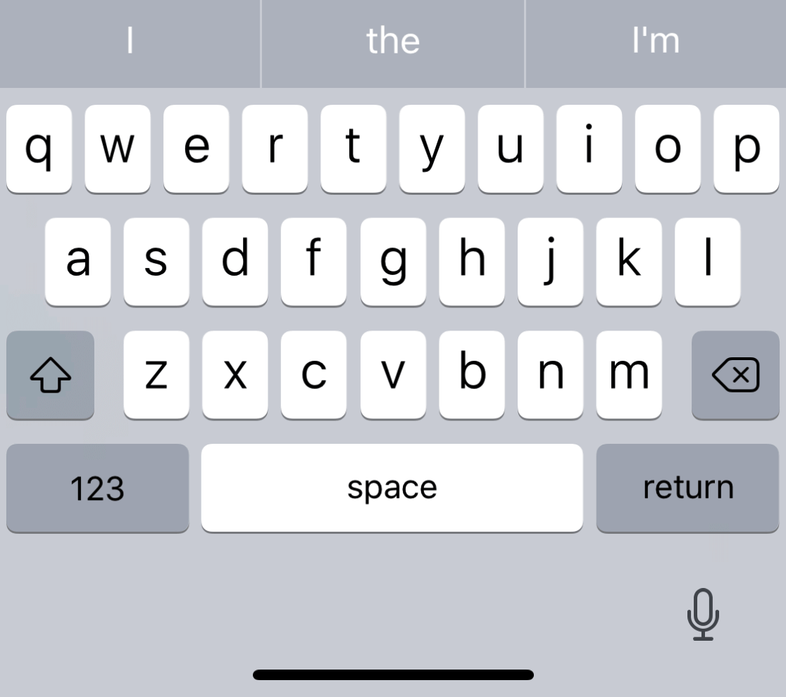
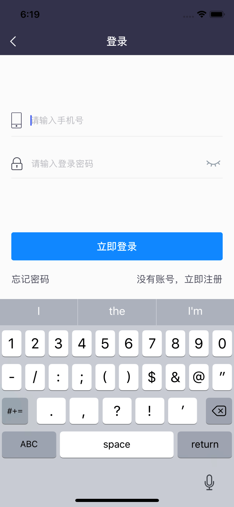
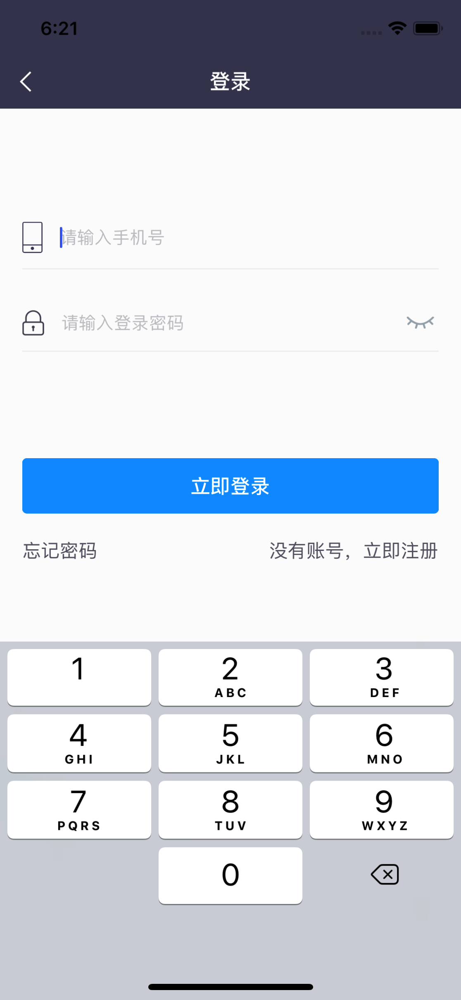
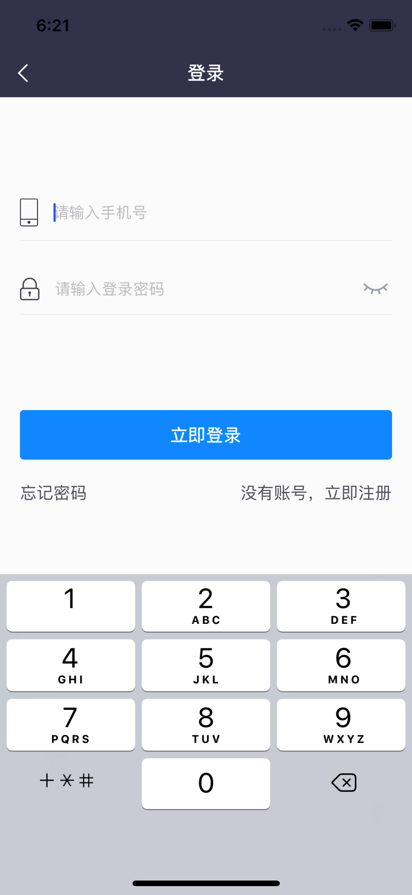
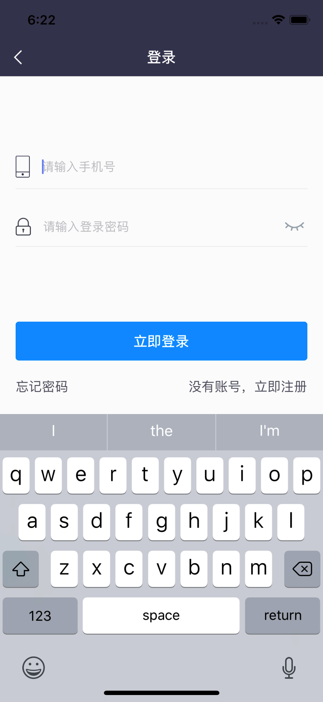
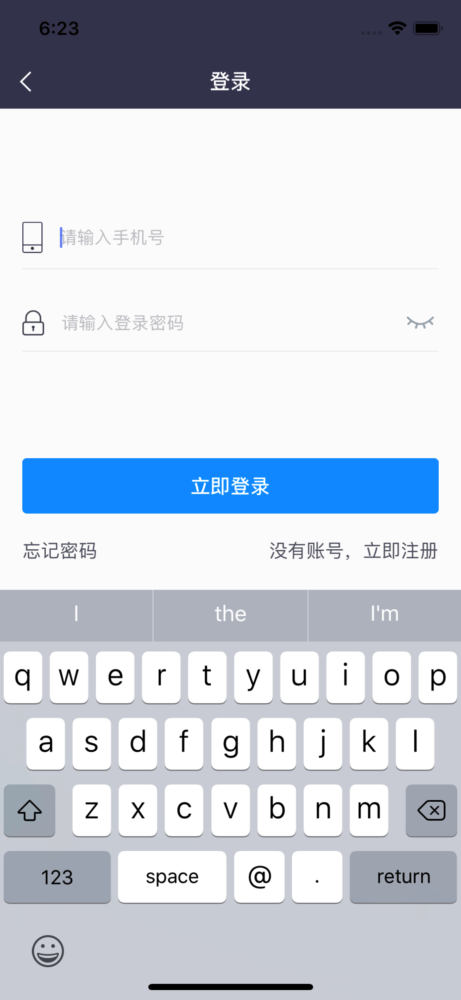
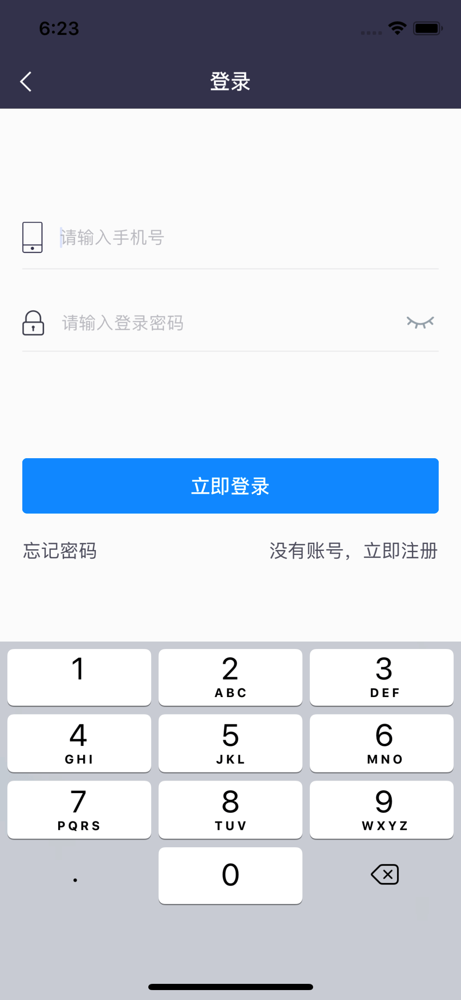
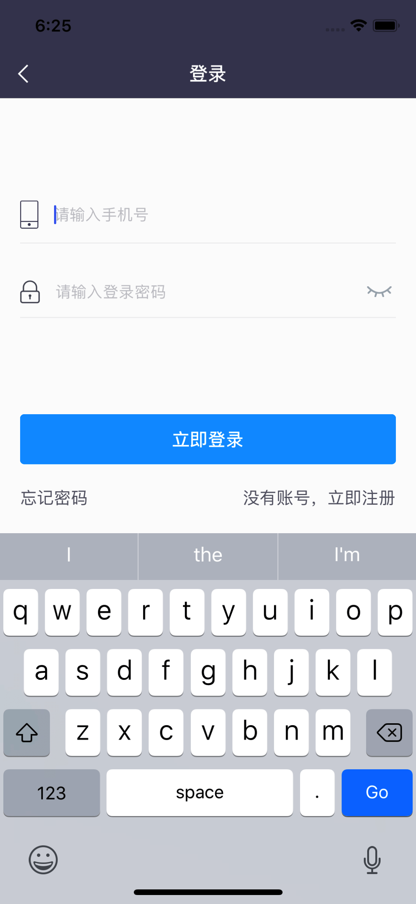
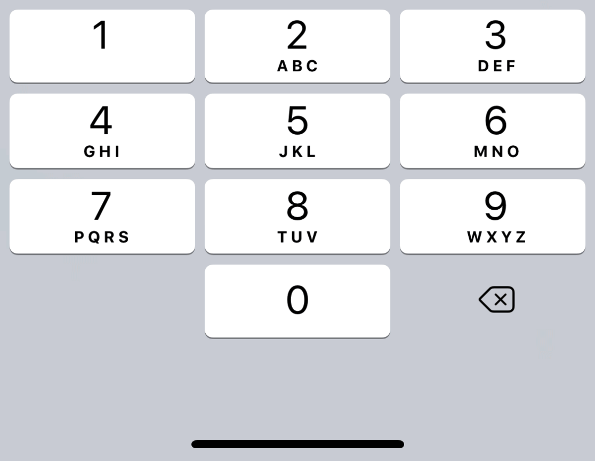

#iOS 键盘类型

* 1-Default 

* 2-AXSII Capable

* 3-Numbers and Punctuation

* 4-URL

* 5-Number Pad

* 6-Phone Pad

* 7-Name Phone Pad

* 8-Email Address

* 9-Decimal Pad

* 10-Twitter

* 11-Web Search

* 12-ASCII Capable Number Pad

