#iOS 键盘类型

* 1-Default 
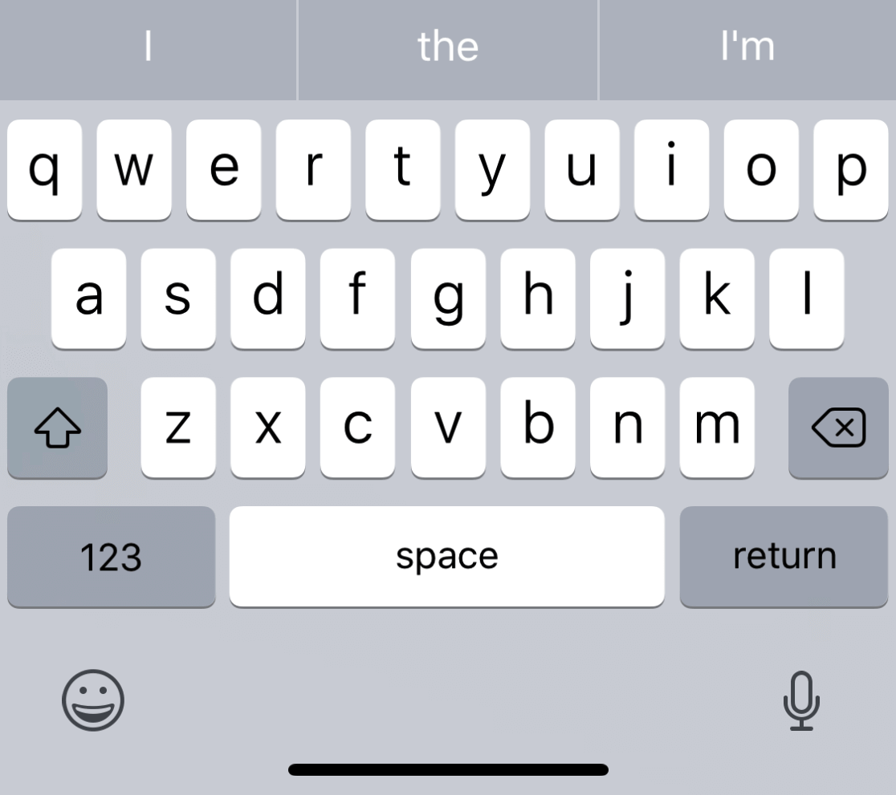

* 2-AXSII Capable
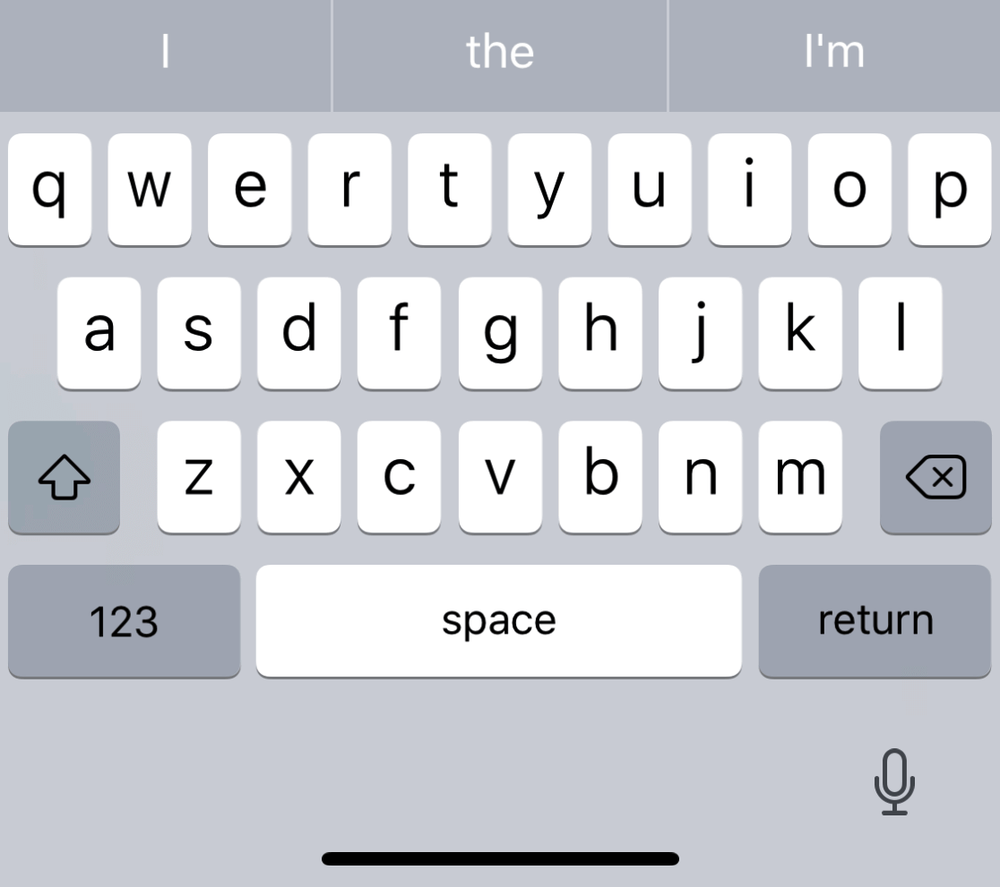

* 3-Numbers and Punctuation
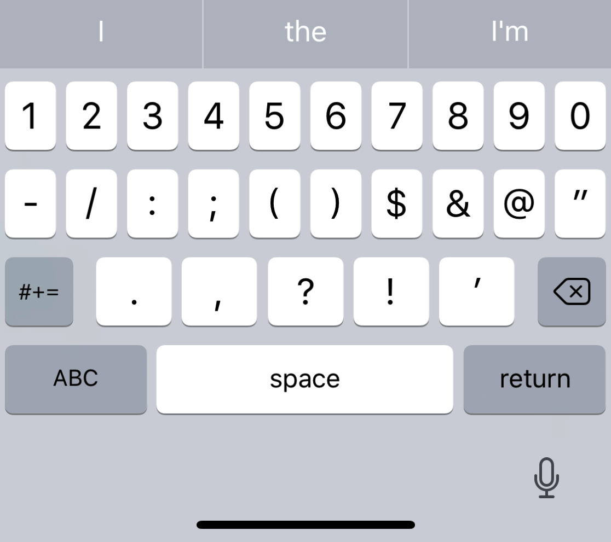

* 4-URL
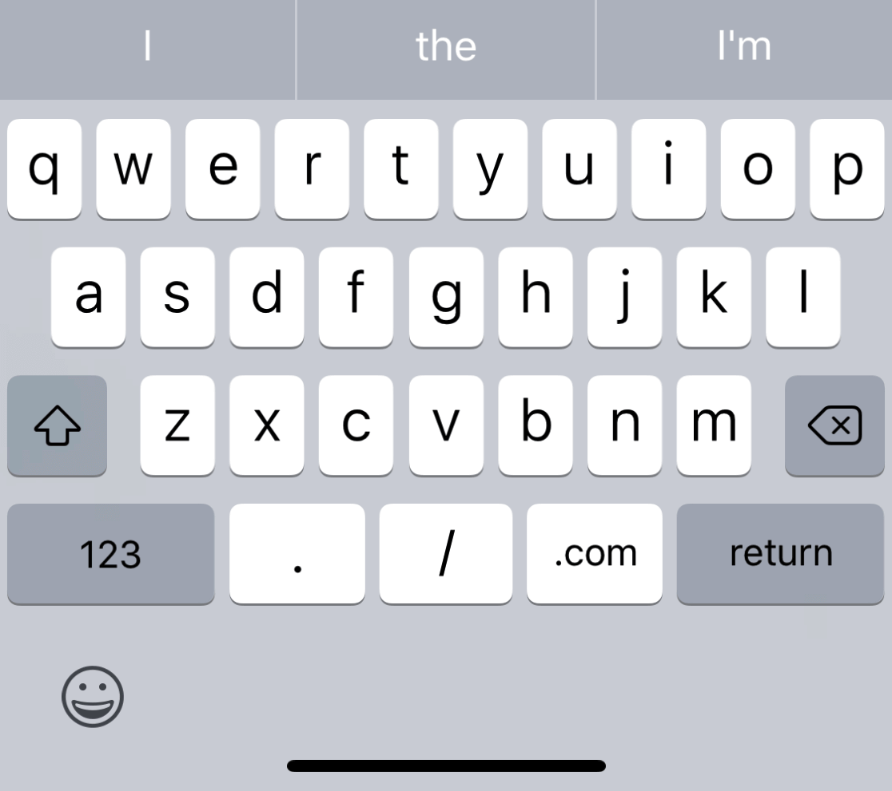

* 5-Number Pad
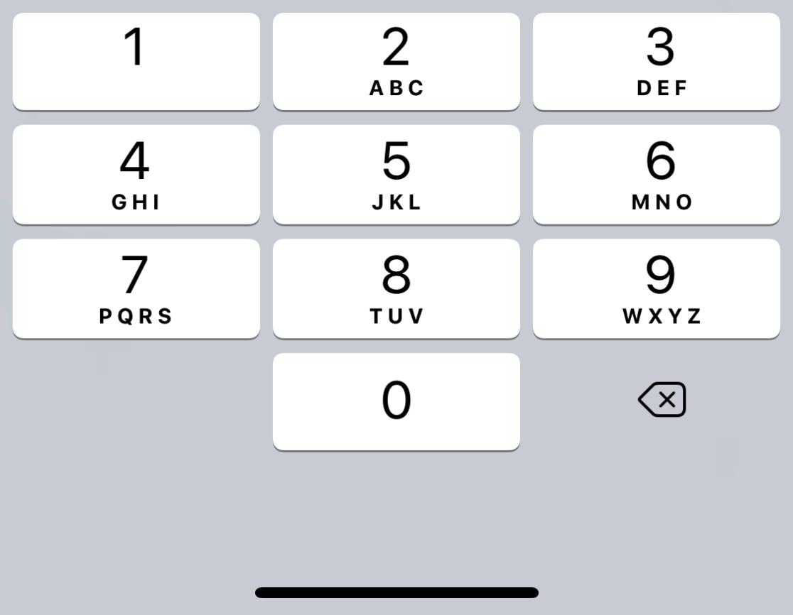

* 6-Phone Pad
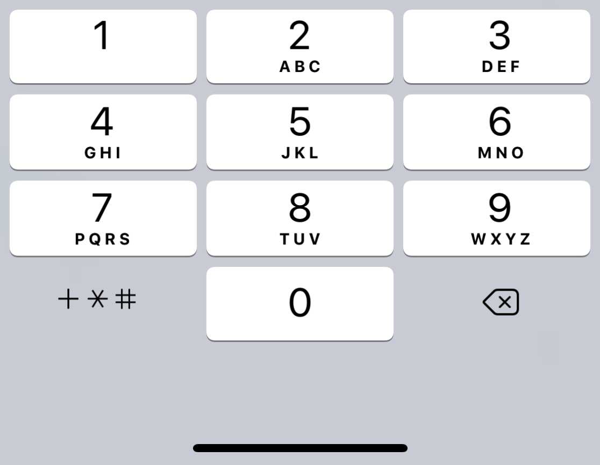

* 7-Name Phone Pad
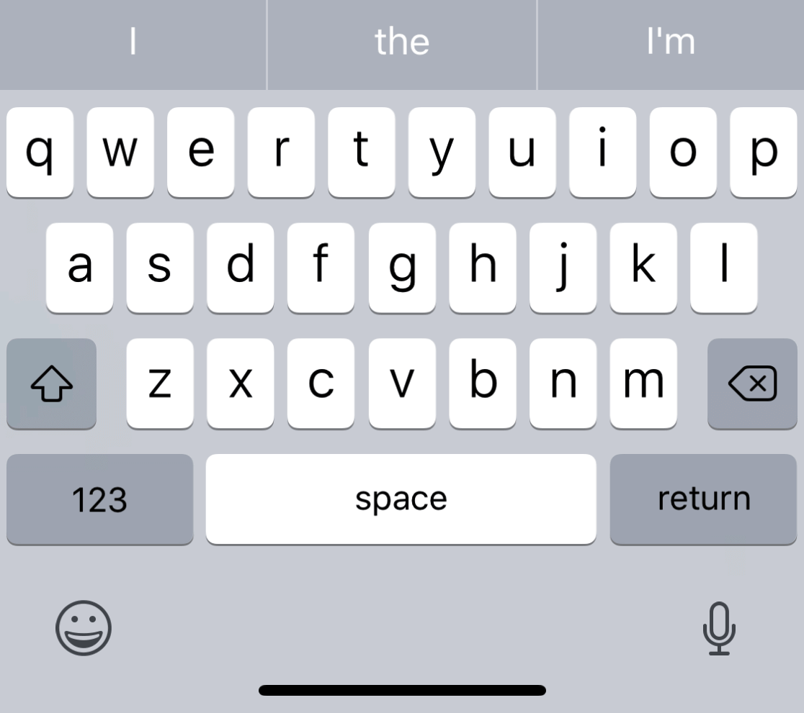

* 8-Email Address
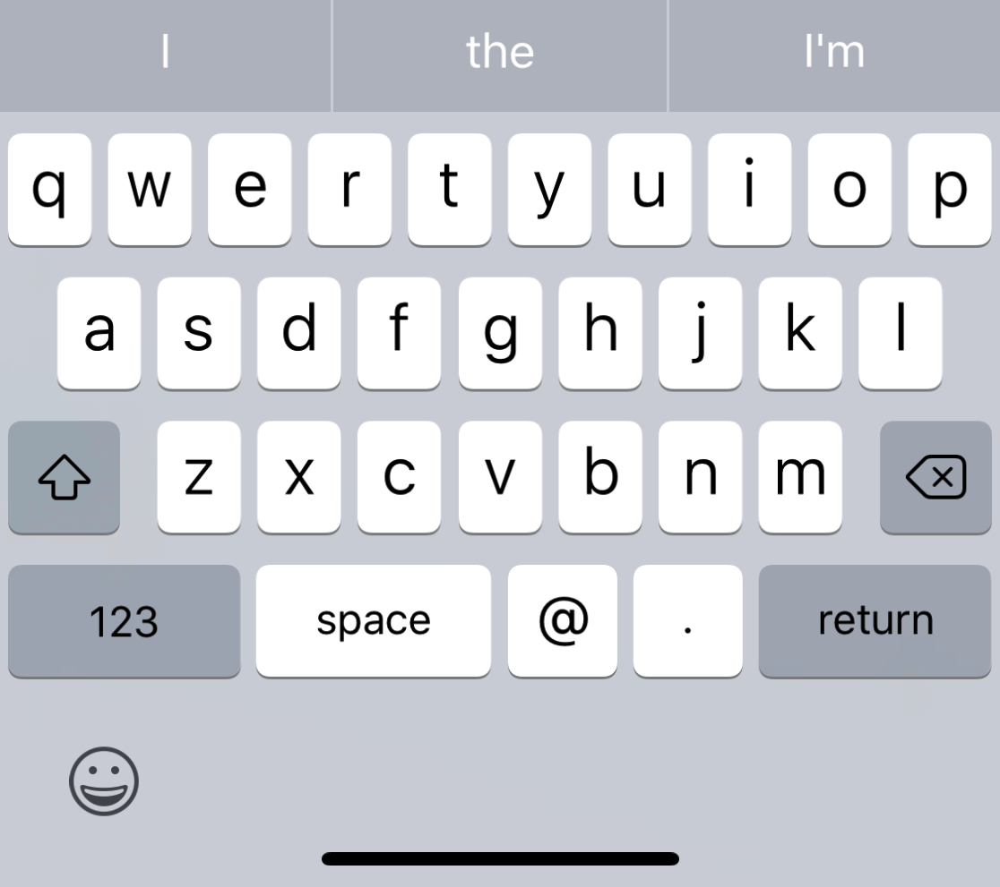

* 9-Decimal Pad
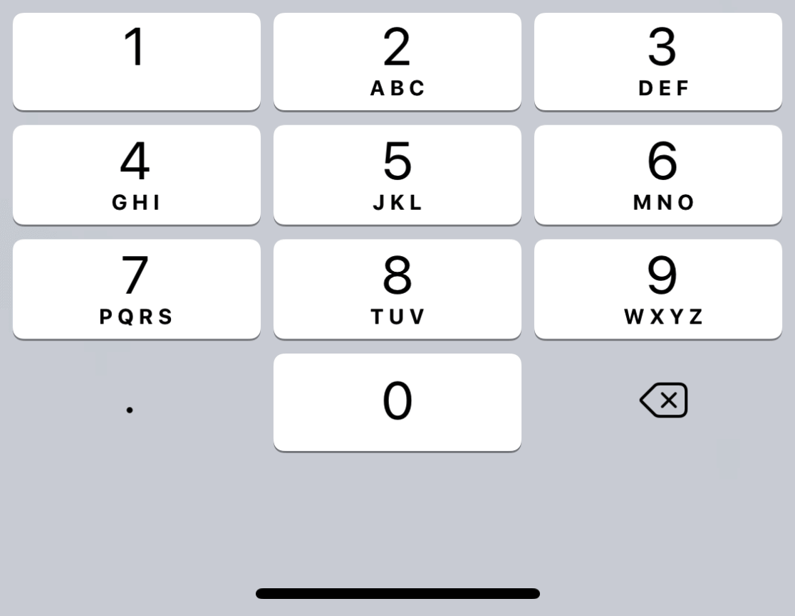

* 10-Twitter
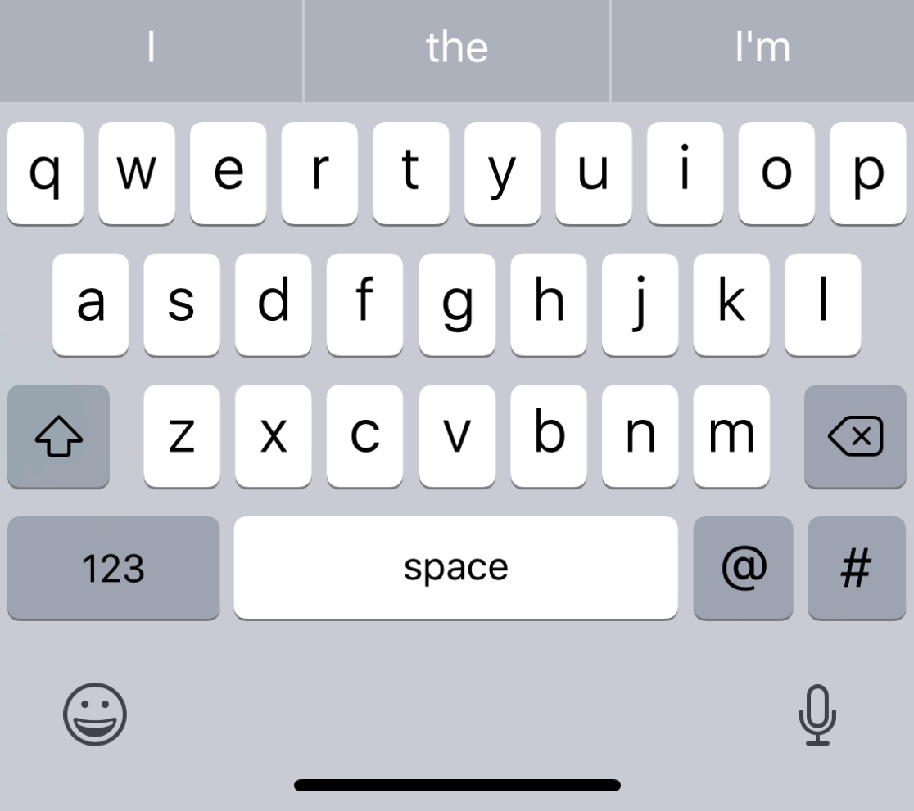

* 11-Web Search
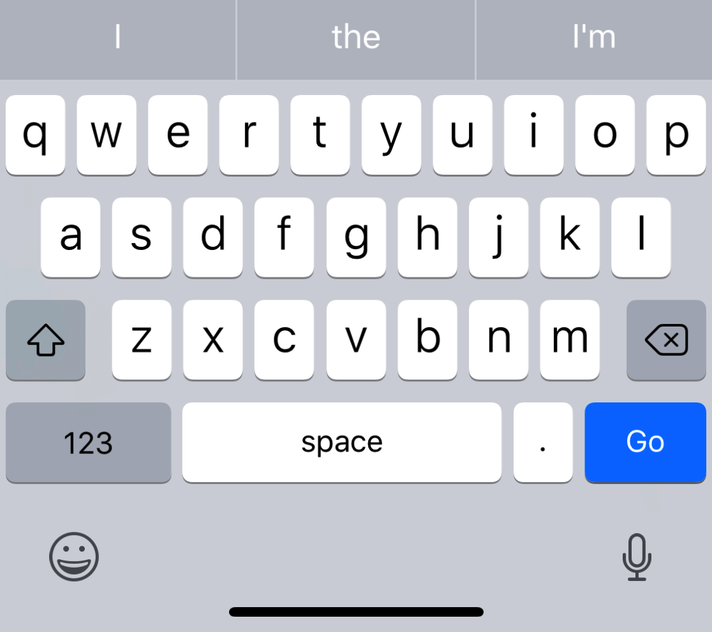

* 12-ASCII Capable Number Pad
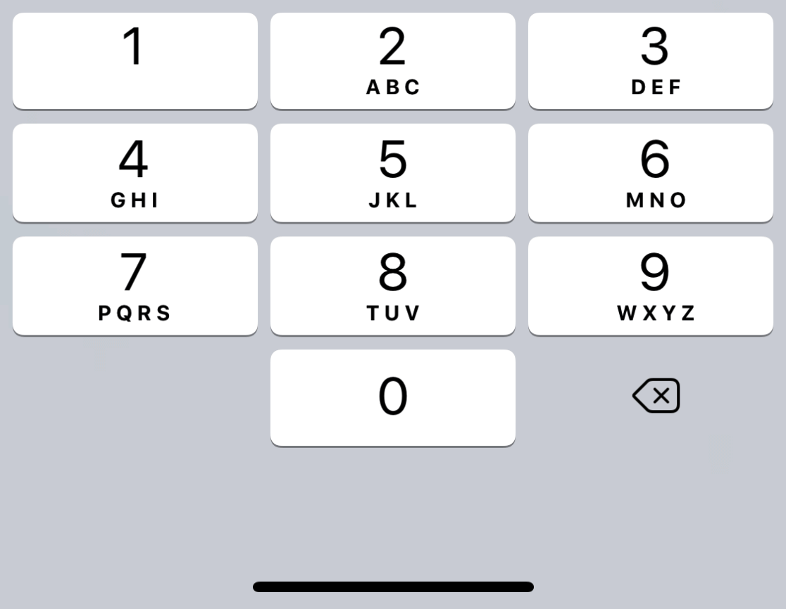
